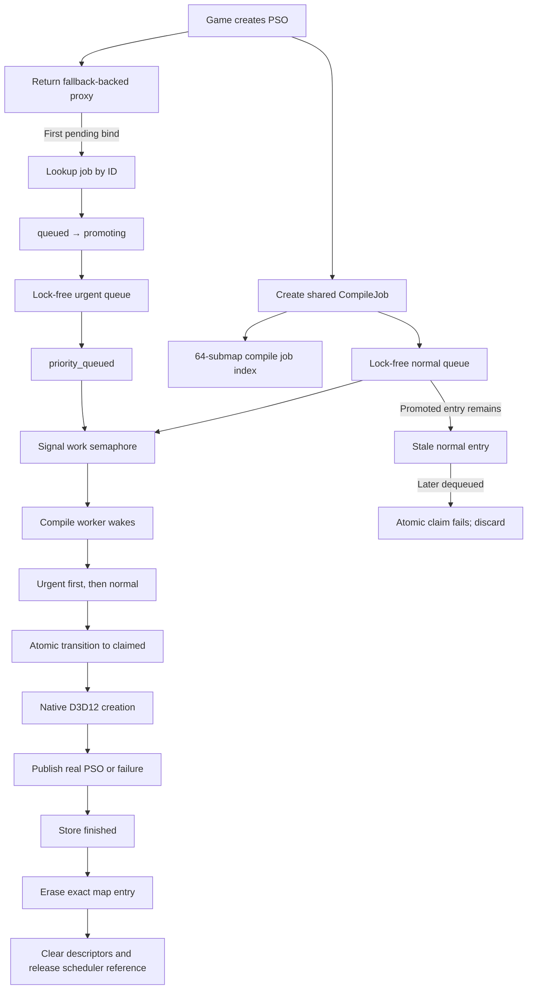

## 1. The game creates a PSO

The game calls one of the intercepted D3D12 methods:

- `CreateGraphicsPipelineState`
- `CreateComputePipelineState`
- `CreatePipelineState` for a pipeline-state stream

The async manager first determines whether the request is eligible for asynchronous creation.

Unsupported requests continue through ordinary synchronous D3D12 creation.

For an eligible request, the manager:

1. creates or retrieves a fallback PSO;
2. creates a unique `D3D12AsyncPipelineProxy`;
3. deep-copies the game-owned pipeline descriptor;
4. creates a `CompileJob`;
5. publishes that job to the scheduler;
6. immediately returns the proxy to the game.

At this point, the game sees successful PSO creation, but the proxy resolves to the fallback until native compilation finishes.

---

## 2. Constructing the compile job

`enqueue_compile_job` creates a shared job node:

```text
CompileJobPtr → CompileJob
```

The job contains:

- the proxy pointer;
- the copied graphics, compute, or stream descriptor;
- the unique proxy/job ID;
- the atomic job state.

The initial state is:

```text
queued
```

The `shared_ptr` permits the map, queue, worker, and stale queue entries to safely share the same job allocation.

The scheduler also takes one COM reference on the proxy. This keeps the proxy alive even if the game releases its reference before background compilation finishes.

---

## 3. Lifecycle admission

Before publishing the job, enqueue takes a shared lock on:

```cpp
_compile_lifecycle_mutex
```

This is not a queue lock. Multiple game threads can hold it concurrently and publish jobs in parallel.

Its purpose is only to coordinate against manager shutdown:

```text
normal operation:
    many enqueue/promotion shared locks allowed

shutdown:
    one exclusive lock
    set _stop
    prevent further publication
```

The enqueue path checks `_stop` after acquiring the shared lock. This ensures shutdown cannot begin in the middle of job publication.

---

## 4. Publishing in `_compile_jobs`

The manager:

1. takes its scheduler-owned proxy reference;
2. increments `_pending_compile_jobs`;
3. inserts the job into `_compile_jobs`.

`_compile_jobs` is a 64-submap `parallel_node_hash_map`.

There is no global queue mutex around the insertion. Only the map submap selected by the job ID is exclusively locked.

Consequently, jobs with IDs distributed across different submaps can be inserted concurrently:

```text
Game thread A → map submap 3
Game thread B → map submap 19
Game thread C → map submap 51
```

`_compile_jobs` serves two purposes:

- it owns/indexes all unfinished jobs by ID;
- it allows a later PSO bind to find and promote a specific job.

---

## 5. Publishing to the normal queue

After map insertion, enqueue places the `CompileJobPtr` into:

```cpp
_normal_compile_queue
```

This is a `moodycamel::ConcurrentQueue<CompileJobPtr>`.

It is an MPMC queue:

- multiple game threads can enqueue simultaneously;
- multiple compile workers can dequeue simultaneously;
- there is no application-level queue mutex.

If publication succeeds, enqueue signals one token on:

```cpp
_compile_work_semaphore
```

The relationship is:

```text
one physical queue entry → one semaphore token
```

This includes stale entries created by later promotion. Every physical queue entry remains paired with one worker wake token.

The enqueue path then returns, and the game receives its proxy.

---

# Worker side

## 6. A worker waits for work

Every worker owns:

- one consumer token for the urgent queue;
- one consumer token for the normal queue.

When idle, the worker calls:

```cpp
_compile_work_semaphore.wait();
```

This blocks without polling.

A successful wait consumes one token, which means at least one physical entry was published into one of the two queues. The worker then proceeds directly to dequeue and claim work. The pool size is fixed at 75% of available hardware threads.

---

## 8. Urgent-first dequeue

The worker checks:

1. `_urgent_compile_queue`;
2. `_normal_compile_queue` if urgent is currently empty.

Conceptually:

```text
try urgent
    ↓ empty
try normal
```

No shared queue lock is taken.

Strict global ordering against an urgent enqueue occurring at exactly the same instant is not possible with two independent lock-free queues. But at each selection point, workers visibly check urgent first.

---

## 9. Claiming the job

Dequeuing a pointer does not automatically authorize compilation. The worker must win the job’s atomic state transition.

For an urgent job:

```text
priority_queued → claimed
```

For a normal job:

```text
queued → claimed
```

Only one compare-and-exchange can win.

Therefore, even if the same job physically appears in both queues, exactly one worker can compile it.

If neither transition succeeds, the entry is stale. The worker returns to waiting for another semaphore token.

---

# Promotion after the game binds a pending PSO

## 10. The game binds the proxy

Later, the game calls `SetPipelineState` with the proxy.

The command-list integration resolves the proxy through `current_native_for_bind`.

If the real PSO is not yet available:

1. the command list receives the fallback;
2. `_compile_priority_requested` performs a one-shot promotion request;
3. the manager calls `prioritize_compile_job(id)`.

Repeated binds normally do not repeatedly enter the scheduler.

---

## 11. Looking up the job

Promotion takes a shared lifecycle lock to prevent shutdown from crossing publication.

It then looks up the ID using:

```cpp
_compile_jobs.if_contains(id, callback)
```

Only the corresponding map submap receives a shared lock. Other map submaps remain available concurrently.

The callback copies the owning `CompileJobPtr`. It does not leave a raw map iterator or reference outside the callback.

---

## 12. Entering `promoting`

The promoter attempts:

```text
queued → promoting
```

If this fails, one of these is usually true:

- a normal worker already claimed the job;
- the job was already promoted;
- compilation finished;
- shutdown cancelled it.

No further action is necessary.

The temporary `promoting` state closes the race between the original normal entry and publication of the urgent entry.

---

## 13. Publishing the urgent entry

The promoter enqueues the same `CompileJobPtr` into:

```cpp
_urgent_compile_queue
```

If enqueue succeeds:

```text
promoting → priority_queued
signal one work token
```

The job now physically appears twice:

```text
normal queue: stale original entry
urgent queue: valid urgent entry
```

The normal entry is deliberately not searched for or removed. Arbitrary removal from a concurrent queue would be expensive and complicated.

If urgent publication fails because of allocation pressure:

```text
promoting → queued
```

The original normal entry becomes valid again. The proxy’s one-shot promotion flag is reset so a later bind may retry promotion.

---

## 14. Promotion races with a worker

A worker may have already dequeued the normal entry while promotion is in progress.

It sees:

```text
promoting
```

and briefly yields until promotion resolves.

Two outcomes exist.

### Promotion succeeds

```text
promoting → priority_queued
```

The worker may claim that same job through:

```text
priority_queued → claimed
```

This is valid even if the worker obtained the pointer from the normal queue. Queue origin is less important than current job state.

The separately published urgent entry later becomes stale.

### Promotion fails

```text
promoting → queued
```

The worker may claim normally:

```text
queued → claimed
```

No work is lost.

---

# Native compilation

## 15. The worker compiles the real PSO

After winning `claimed`, the worker invokes:

- add-on creation and initialization events, when enabled;
- `CreateGraphicsPipelineState`;
- `CreateComputePipelineState`; or
- `ID3D12Device2::CreatePipelineState`.

No scheduler queue or map lock is held during this operation. The fixed worker count is the only concurrency limit.

---

# Successful completion

## 17. Publishing the real PSO

On success, the worker calls:

```cpp
proxy->set_real(real)
```

The proxy:

1. records the successful result;
2. replays deferred pipeline-library stores;
3. replays residency intent;
4. snapshots and applies proxy metadata;
5. atomically publishes the real native PSO;
6. changes `_current` from fallback to real;
7. wakes callers waiting in `GetCachedBlob`.

Future binds resolve directly to the real PSO.

A command list that previously recorded a fallback keeps that binding until the application binds the pipeline again. Draw and dispatch do not perform an implicit real-PSO rebind.

---

# Failed completion

## 18. Recording terminal failure

If native creation fails, the worker calls:

```cpp
proxy->set_compile_failed(hr)
```

The proxy:

- records the terminal HRESULT;
- wakes `GetCachedBlob` waiters;
- discards deferred stores;
- keeps the fallback as the currently bound object.

Validation messages are reported if the D3D12 debug-layer queue is available.

---

# Scheduler completion

## 19. Marking the job finished

The worker stores:

```text
claimed → finished
```

This invalidates any stale physical queue entry for the job.

A stale normal or urgent entry may still hold a `shared_ptr`, but it can no longer win a claim transition.

---

## 20. Removing the map entry

The worker removes its job from `_compile_jobs` with identity-checked `erase_if`:

```text
erase only if:
    entry ID matches
    stored pointer is this exact job
```

Only one map submap is exclusively locked.

The worker already owns a local `CompileJobPtr`, so erasing the map reference cannot destroy the job while the submap lock is held.

The worker then, outside map callbacks:

- destroys copied descriptor data;
- releases the scheduler-owned proxy reference;
- decrements `_pending_compile_jobs`.

---

# Stale queue entries

## 21. A stale entry is eventually dequeued

Suppose an urgent job completed, but its original normal entry remains deep in the startup queue.

Eventually another worker consumes its semaphore token and dequeues that stale entry.

It observes:

```text
finished
```

Both possible claims fail:

```text
priority_queued → claimed  // fails
queued → claimed           // fails
```

The worker waits for another token.

No map lookup, D3D12 creation, proxy call, or descriptor work occurs.

The stale entry’s final `shared_ptr` may be destroyed at that point. The job’s large descriptor data was already cleared during completion, so its retained footprint is small.

---

# Shutdown

## 22. Admission closes

The manager destructor takes `_compile_lifecycle_mutex` exclusively.

This waits for any current enqueue or promotion transaction to finish. It then sets `_stop`.

After the exclusive lock is released:

- no new enqueue transaction can be admitted;
- no promotion can publish another urgent entry.

---

## 23. Workers are awakened and joined

Shutdown signals enough semaphore tokens to awaken all workers.

Workers check `_stop` immediately after waking and return without claiming new jobs.

Workers already inside native D3D12 creation finish their claimed job normally. The manager then joins all compile workers.

At that point, no worker can touch either queue or `_compile_jobs`.

---

## 24. Remaining entries are cancelled

The destructor drains both physical queues.

It then walks `_compile_jobs` using the parallel map’s safe callback API and transitions remaining unclaimed jobs:

```text
queued          → finished
promoting       → finished
priority_queued → finished
```

For each cancellation winner, it:

- removes the exact map entry;
- calls `set_compile_failed(E_ABORT)`;
- clears copied descriptors;
- releases the scheduler proxy reference;
- decrements pending jobs.

Finally it verifies:

- `_pending_compile_jobs == 0`;
- `_compile_jobs.empty()`;
- queues have been drained;
- compile workers have stopped.

---

## Overall ownership model



The key separation is:

- **Concurrent queues** transport physical work references.
- **The parallel map** finds and owns unfinished jobs by ID.
- **Atomic job state** decides who may compile.
- **The semaphore** parks and wakes workers.
- **The fixed worker pool** limits concurrent native D3D12 creation.
- **The lifecycle mutex** only coordinates normal admission with shutdown.

---

# Fallback and add-on behavior

## 25. Fallback pipelines have a complete add-on lifecycle

Fallback PSO creation invokes the normal `create_pipeline` and `init_pipeline`
events, and destruction invokes the matching lifecycle event. Their handles are
not exposed through command-list `bind_pipeline` events.

Add-ons currently observe but do not modify fallback descriptors. This keeps the
manager's fallback compatibility assumptions stable while still giving add-ons
enough lifecycle information to associate metadata with every handle they see.

## 26. Bind events hide pending fallback pipelines

While a proxy is pending, command-list initialization, `Reset`, `ClearState`, and
`SetPipelineState` do not publish a `bind_pipeline` event for the native fallback.
The pending bind still prioritizes its compile job. Once compilation completes, a
later application bind resolves the proxy and publishes the real native handle.
Already-recorded command lists are not rebound immediately before draw or dispatch.

## 27. Fallback modes select which native work is suppressed

With `FallbackMode=0`, unresolved fallback draws, indexed draws, dispatches,
indirect commands, and mesh dispatches are not sent to the native D3D12 command
list. Mode `1` allows all, mode `2` skips non-dispatch commands, and mode `3`
skips dispatch and mesh dispatch only. Indirect execution is treated as
non-dispatch because command-signature contents are not tracked here. The
corresponding add-on events are still invoked before a skipped command returns.

The callback return value is irrelevant in this path because native execution is
already suppressed. Emitting the event lets add-ons perform per-command cleanup
and maintain consistent state even when no GPU work is recorded.

---

# Compile-worker policy and diagnostics

## 28. Worker concurrency is fixed

The compile pool contains 75% of available hardware threads. This count is
chosen when the manager is constructed and does not change at runtime. Present
does not publish compile-control data, and workers do not wait on a secondary
slot limiter after receiving queue work.

## 29. Queue diagnostics measure implementation stalls only

Queue backlog age is intentionally not a warning because it represents expected
startup backlog. With
`[ASYNC] Debug=1`, timing surrounds only direct concurrent-queue enqueue and
dequeue operations. An operation taking at least 10 ms is logged as a potential
queue implementation stall.

With Debug disabled, these queue operations execute without diagnostic clock
reads. Periodic counters and deferred `StorePipeline` failure summaries are also
reported only every 512 events while Debug is enabled; rare native failures
remain visible independently.